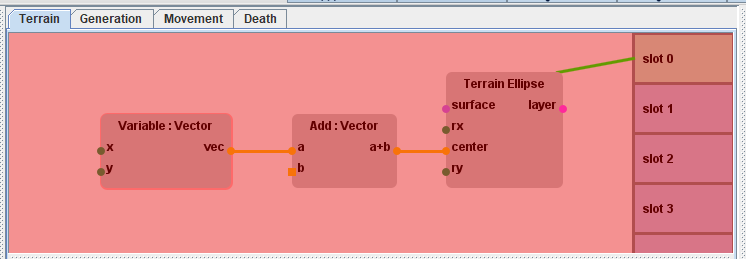

# NodalWorld
## Abstract

Java swing project for the HCI909 - Advanced UI course.
The goal of this project is to create a world simulation game where the user can set the rules with a nodal programming window.

## Execution

In order to launch the program go to the "Java" directory, in which you will find a JAR file : 
it contains a single entry point, therefore you can execute it directly (no external library is needed).

If you want to take a look at the source files, a documentation is here to help you : 
go to the "doc" directory and open the index.html file, it will open the project's javadoc in your browser.

## Description

When starting the application, the template dialog box will open.
You can then select the template you want to start your world with.
If it's your first time using Nodal World, we recommend you to choose the Demo template. And if you want to experiment with the nodes without bothering with importing species and surfaces, you can try the Basic template.
Note that on the bottom left part of the window you have two input fields that you can use with some templates to determine the dimension of the world's terrain.

Once you've selected your template and possibly loaded a file, a window similar to this should pop.

The first element of this window is the menubar, on the top.
Its elements are separated in 3 groups.
The left one is about how the simulation plays. It has a Play/Pause button, a button to speed up the simulation and one to slow it down. It also displays the current simulation step (also called frame).
The group on the right has a button to save the current simulation, and one to start a new simulation. Clikcing on this button will open the same Template selection dialog box as when the app starts.
Eventually, the group at the center has a direct effect on the world panel, described just bellow.

### World Panel

The main part of the window is separated between the Control panel on the left and the World panel on the right.

The World panel is a view of the world. It is not interactive, however you can change its appearance using the menubar's buttons:
- display a light green grid on top of the world to help identify the tiles
- flip between displaying the tiles' surfaces using the surfaces' images or their color.
- zoom in
- zoom out
- reset the zoom

### Control Panel: Node Editor

The Control panel is composed of several utility toolbars on the left, and the nodal editor on the right.
The nodal editor has 4 tabs, one for each kind of rule (terrain, entity generation, entity movement and entity death).
You can zoom and pan the nodal editor by holding left shift or left control while dragging the mouse.

In this section, you can add node by right clicking and selecting a node in the menu that will open.

Each node has inputs and/or outputs. Those have a specific type and each type is correlated to a specific color.
You can link different nodes by dragging the mouse from an ouput to the input you want to connect it with (you can also start from the input and go to the output). A link can be created only if the input and output have the same type and if it doesn't lead to a cycle in the node graph. Some inputs require to be connected to an output due to their type. Such inputs are represented with a square instead of a circle when not connected (thus we'll call those inputs "square inputs" in the rest of the readme). A single output can be connected to an infinite number of inputs, but an input is always connected to one or none output. To disconnect an input and an output, drag the mouse from the input to nothing.

You can select a node by clicking on it. Its properties will then appear in the Info panel that is located on the bottom part of the nodal editor. There you can set a manual value to the "non square" ones.

You can also select several node at one time by dragging a rectangular selection area that intersects with the nodes you want.
A selected node or a group of selected nodes can be moved by dragging them, or removed by pressing the Delete key.

Finally, you can connect terminal nodes (located in the "Rules" and "Terrain" categories) to terrain or species slots in order to make them use the terminal node and all its linked nodes on evaluation. To do so, start to draw your link by dragging from the slot to the terminal node. If you need to, you can scroll the list of slots by rolling your mouse wheel (or equivalent gesture on a touch pad).
To disconnect a slot drag the mouse from the slot to nothing.

If a terminal node is connected to an invalid node, the graph will be ignored and a red filter will appear over the node editor. Plus, an error message will pop on the printer (see the utility toolbar section).

### Control Panel: Toolbars

Last part of the window, the utility toolbar is composed or 4 different toolbars that the user can freely rearrange.

The first one is the terrain manager. It offers a terrain visualizer and possibility to focus a specific terrain slot. It also offers the ability to add, remove or rearrange terrain slots. It displays and allows the user to edit the dimensions of the terrain and the terrain trigger period (i.e. after how many simulation steps the terrain graph will be re-evaluated to potentially change the terrain).

The second one is the Surface manager. It allows to manipulate the surfaces used by the terrain slots by adding, removing or reordering them. It also gives the ability to change the surface's color or image by clicking on the corresponding field. It will then open a file chooser dialog box to change the image or a color wheel dialog box to change the color. Don't forget to hit the "Apply" button to apply any change done before selecting another surface.

The third one is the Species manager. Like the Surface manager, it allows to manipulate the species of the world. However, the properties displayed are different. The "Count" field indicates how many entities of the species are alive (warning : by default, there is no death rule, so an entity outside of the terrain won't be displayed but would still be alive and processed at each simulation step). The button at the right end of that field allows to instantly kill all the entity of the selected species. The species trigger period is, similarly to the terrain trigger period, the number of simulation steps to perform between each evaluation of the species rules' graphs. Don't forget to hit the "Apply" button to apply any change done before selecting another species.

Eventually, the fourth one is the Printer.

This is where are printed the values received by the printer nodes. All those nodes are in the category "Printer" in the node menu. To print a message, the output of the node must be used by the rest of the graph. Setting the "enable" input to false will prevent the node to send its message. The Label input is an optional text to put in front of the message (for example "GrassMask" on the following screen capture). If you change the label, don't forget to press the "Enter" key once done otherwise the change isn't applied.

The printer will also print the network errors sent by the node editor (for example, if the user forgot to link a "square" input like in the screen shot, or asks to divide by 0). An error message is printed in red. It explains what went wrong (general indication), the type of the input/output that detected the error, and the terminal node class to which the node detecting the error is connected to.

The printer offers the possibility to display all the messages in memory or only the ones from the last frame with message. It also provides the possibility to display the simulation step amongside the message.
The messages received are deleted from memory when "too old". To define "too old" the user has a "Buffer" value that he can change. If a message is from a frame that is older than [the last received message's frame - buffer], then it's considered as"too old" and gets deleted.

